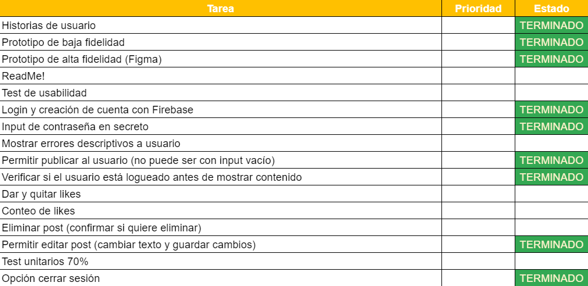
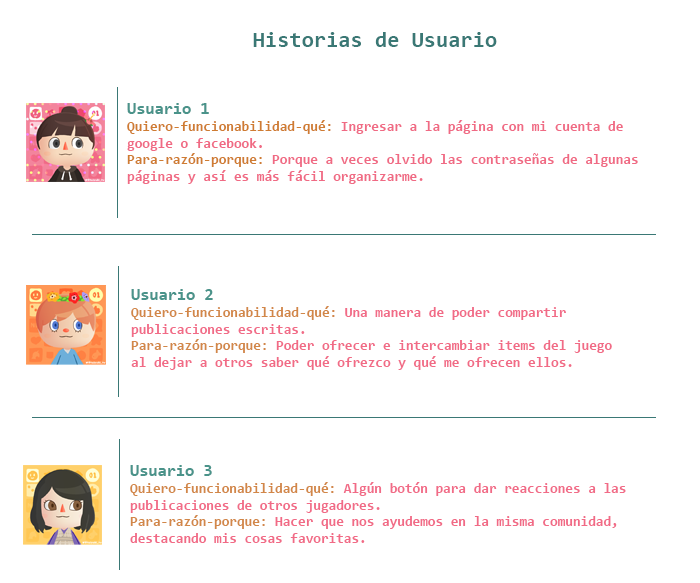
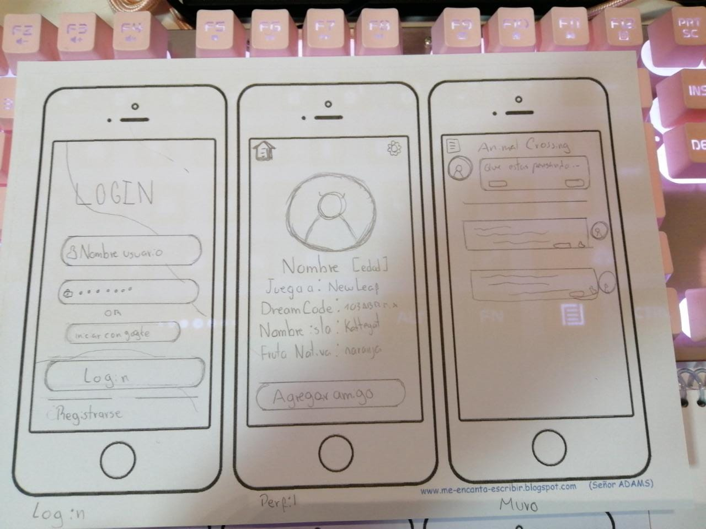
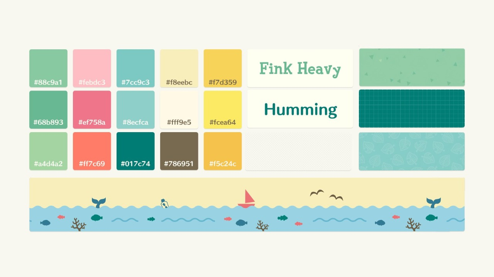
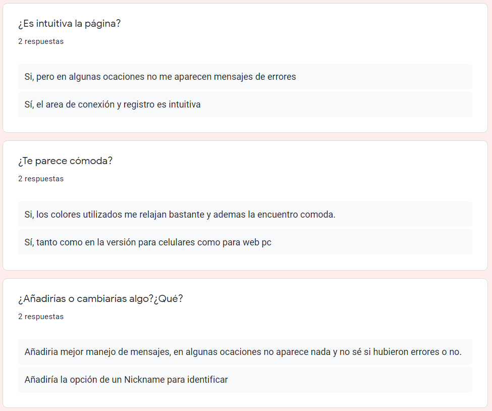

# NOOK-NOOK SOCIAL NETWORK

## Índice

* [1. Definición](#1-definición)
* [2. Planificación Inicial](#2-planificación-inicial)
* [3. Prototipos](#3-prototipos)
* [4. Test de usabilidad](#4-test-de-usabilidad)
* [5. Producto Final](#5-producto-final)

## 1. Definición 

Nook-Nook es una red social diseñada para jugadores de la popular franquicia ‘Animal Crossing’ en cualquiera de sus versiones. Pese a ser una comunidad masiva, actualmente no existe un lugar en la web exclusivo para sus usuarios más allá de grupos privados y reducidos. Por ende el objetivo principal de la presente aplicación es presentarse como un espacio donde puedes conocer e intercambiar información relevante al juego con otras personas sin necesidad de compartir datos personales o ajenos al mismo. 
#### 

## 2. Planificación Inicial

En primera instancia se comenzó con una lluvia de ideas sobre qué elementos deberían estar incluidos en la aplicación (tales como página de login, muro para postear, botones de like, etc) y cómo estas se representan visualmente. Posteriormente, dividimos dichas tareas en una plantilla de flujo de trabajo, de esta forma, tendríamos presente qué elementos completaríamos semana a semana. 
#### 

Luego de ello elaboramos una pequeña encuesta con el fin de conocer qué expectativas tendrían los usuarios respecto a la propuesta de una red social enfocada en Animal Crossing y en base a los resultados obtenidos creamos tres historias de usuario principales a cumplir. 
#### 

## 3. Prototipos 

Con las necesidades de los usuarios presentes y una idea inicial de nuestra aplicación, diseñamos un primer prototipo de baja fidelidad en papel de la versión móbil y, en base a ello, luego diseñar uno para la versión web. 
#### 

Presentamos este diseño a compañeras y potenciales usuarios de lo cual concluimos lo siguiente:

* La paleta de colores debería ser similar a la del juego. 
* La sección de ingreso y registro podrían estar en la misma página en lugar de guiar a una pestaña distinta. 
* En el muro se podría registrar la hora en que se realizó un post. 

Teniendo en cuenta ahora el feedback recibido procedimos a realizar los [Prototipos de Alta Fidelidad.](https://www.figma.com/file/1748ZqQrsBs11rj58FdKdN/Nook-Nook?node-id=0%3A1) en FIGMA, tanto para páginas web y la versión móvil (teléfono celular, tablet, etc).
Cabe mencionar que, así como fue sugerido en el feedback, seguimos la paleta de colores y tipografía oficiales de Animal Crossing. 
#### 

## 4. Test de Usabilidad 

Con nuestra página web contando con un login y muro funcional, decidimos testear mediante una breve encuesta. Salvo explicar el público objetivo de la red social y recordar probar tanto la versión web como móvil, no dimos mayores explicaciones a los usuarios con tal de que fuesen ellos quienes exploraran los detalles de la aplicación con libertad. 

Estas fueron las respuestas de los usuarios: 
#### 

Con resultados del test podemos concluir lo siguiente: 
* La página si es intuitiva, es decir, no necesita instrucciones para saber cómo manejarla. 
* La paleta de colores escogida y el diseño en general es cómodo y familiar a Animal Crossing. 
* Aunque es posible identificar al usuario que publicó un post, hubiese sido más efectivo mostrar el nombre en lugar del correo electrónico. 

## 5. Producto Final

Finalmente, luego de los feedback recibidos y todos los ajustes posibles realizados, Nook-Nook, nuestra aplicación de Red Social, luce de la siguiente manera: 

* Versión Web
#### 
#### 
